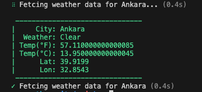

# Weather CLI

- Weather CLI tool using Open Weather API with city flag

## Usage


- clone weather_cli project from link bellow

```Shell
git clone https://github.com/tyypgzl/weather_cli.git
```

- Go to [Open Weather](https://openweathermap.org/) website and get API KEY
- Replace "apiKey" value with your API KEY in open_weather_client.dart

- activete cli globally with dart

```Shell
dart pub global activate --source path .
```

- Use weather cli code bellow

```shell
weather --city=London
```

## Result

<table>
  <tr>
     <td></td>
  </tr>
</table>